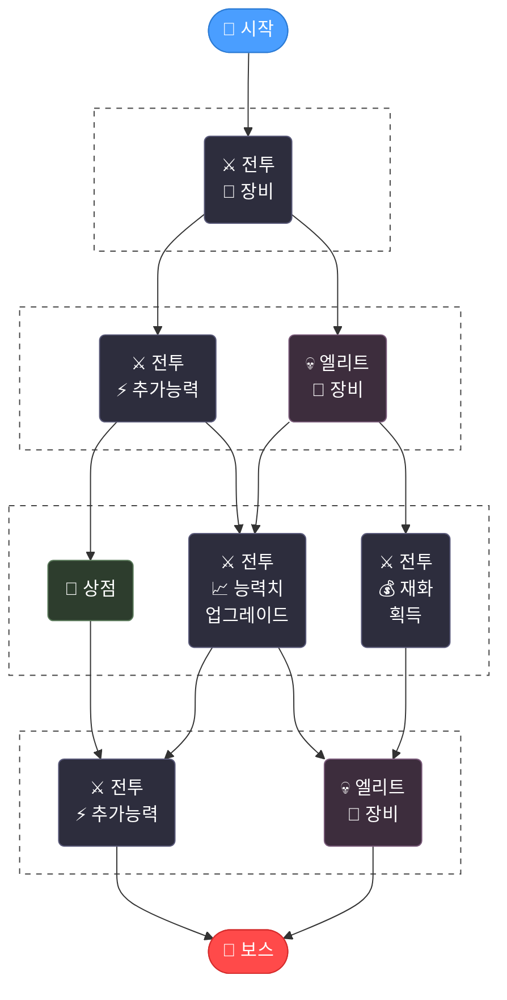

# ProjectReboot

<p align="center">
  <strong>UE5.6 Sci-fi TPS 로그라이트</strong>
</p>

<p align="center">
  
  
  
  
</p>

---

## 🎥 시연 영상

[](https://www.youtube.com/watch?v=5mQ2G_5QyIY)

---

## 🎮 게임 소개

> 하데스 스타일 진행 구조를 차용한 Sci-fi TPS 로그라이트

룸 단위로 전투 → 보상 선택 → 다음 룸 진입을 반복하며 캐릭터를 강화해 나가는 싱글플레이 게임.

룸 입장 → 전투 → 보상 선택 → 다음 룸 선택을 반복하며 스테이지 클리어를 목표로 한다.



> ⚔️ 전투 · 💀 엘리트 · 🛒 상점 · 👑 보스 — 문에 표시된 보상을 보고 경로를 전략적으로 선택

---

## 📅 개발 기간

**2026.01.06 ~ 2026.02.20**

---

## 👨‍💻 개발자

<table>
  <tr>
    <td align="center">
      <strong>배유찬</strong><br>
      기획 · 프로그래밍<br><br>
      <a href="https://github.com/baeyc0510">
        
      </a>
    </td>
  </tr>
</table>

---

## 🏗️ 시스템 아키텍처

```
GameInstance (영구 데이터)
├── RogueliteSubsystem     ← 액션 스택 & 쿼리
├── StageManagerSubsystem  ← 스테이지/룸 그래프
└── UpgradeManagerSubsystem

World (룸 단위, 룸 전환 시 초기화)
├── PrewarmManagerSubsystem  ← 에셋 선제 로딩
├── RoomWorldSubsystem       ← 레벨 인스턴스 관리
├── GameMode                 ← 맵 전환 관리
└── GameState                ← 이벤트 카운트 추적

Level Instance (룸별 독립)
├── RoomController           ← 룸 초기화 & 웨이브
├── PlayerCharacter          ← GAS + 장비
└── Enemies
```

---

## ⚙️ 핵심 시스템

| 시스템 | 설명 | 문서 |
|:---|:---|:---:|
| **로그라이트 시스템** | 모든 획득 가능한 행동을 데이터 에셋으로 관리. 쿼리 파이프라인으로 조건부 필터링 + 가중치 선택 | [📄](Docs/RogueliteSystem.md) |
| **이벤트 드리븐 통신** | 델리게이트 기반 단방향 통신으로 시스템 간 의존성 제거 | [📄](Docs/EventDrivenDesign.md) |
| **Prewarm 시스템** | 룸 전환 시 재귀적 에셋 선제 로딩으로 히치 방지 | [📄](Docs/PrewarmSystem.md) |
| **GAS 어빌리티 체이닝** | GameplayEvent 기반으로 어빌리티 간 직접 참조 없이 능력 조합 | [📄](Docs/AbilityChaining.md) |
| **장비 시스템** | 슬롯 기반 부모-자식 장비 계층 + Rule-Based Visual로 외형 자동 전환 | [📄](Docs/EquipmentSystem.md) |
| **Presentation Model UI** | ViewModel 중앙 레지스트리 + 위젯 자기 바인딩으로 초기화 시점 제약 해소 | [📄](Docs/PresentationModelUI.md) |

---

## 📁 프로젝트 구조

```
ProjectReboot/
├── Source/ProjectReboot/          # 메인 게임 모듈
│   ├── AbilitySystem/            # GAS 컴포넌트, AttributeSet, 어빌리티
│   ├── AI/                       # AI 컨트롤러, StateTree, EQS
│   ├── Animation/                # 8방향 이동, Linked Anim Instance
│   ├── Camera/                   # 카메라, ActorFocus
│   ├── Character/                # 플레이어, 적, NPC 캐릭터
│   ├── Combat/                   # 전투 타입, 트레이스, 저스트 회피
│   ├── Crosshair/                # 크로스헤어 설정 및 스타일
│   ├── Equipment/                # 장비 관리, 인스턴스, 비주얼
│   ├── Game/                     # GameMode, GameState, GameInstance, Prewarm
│   ├── Input/                    # Enhanced Input + GameplayTag 통합
│   ├── Interaction/              # 상호작용 시스템
│   ├── Player/                   # 플레이어 컨트롤러
│   ├── Room/                     # 룸/스테이지 관리, StateTree Task
│   ├── Shop/                     # 상점 시스템
│   ├── UI/                       # ViewModel, 위젯, UI 매니저
│   ├── Upgrade/                  # 영구 업그레이드 시스템
│   └── Utils/                    # 유틸리티
│
├── Plugins/
│   └── RogueliteSystem/          # 로그라이트 진행 시스템 (독립 플러그인)
│       ├── RogueliteCore/        # 액션 DB, 쿼리, 스택 관리
│       ├── RogueliteGAS/         # GAS 통합 브리지
│       └── RogueliteEditor/      # 에디터 도구
│
├── Config/
└── Content/
```
